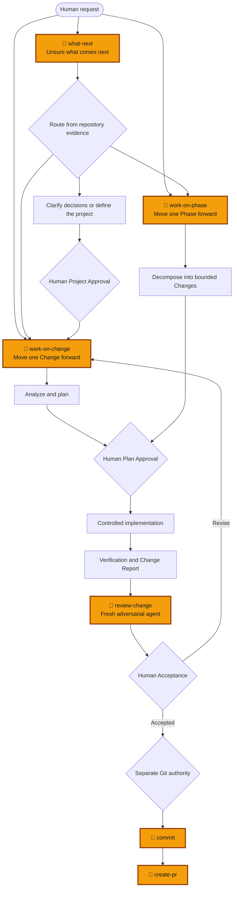
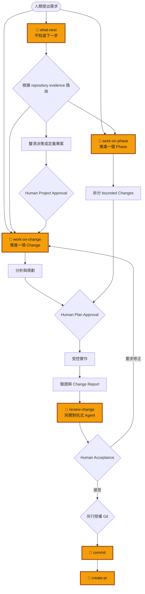

# skill-forge

[](https://github.com/busybutlazy/skill-forge/tags)

Write an AI development workflow once, govern it in one canonical source, and install it for Codex or Claude.

把 AI 開發 workflow 寫一次、集中治理，再安裝到 Codex 或 Claude。

- [English](#english)
- [繁體中文](#繁體中文)

---

# English

## What is it?

`skill-forge` is a project-local skill manager and governance layer for AI coding agents.

It keeps approved skills in one canonical source:

```text
canonical-skills/
        │
        ├── validate version, files, provenance, and package integrity
        │
        ├── render for Codex  →  <project>/.agents/skills/
        └── render for Claude →  <project>/.claude/skills/
```

End users install and update skills through `skill-manager`. Maintainers review and version the canonical packages instead of hand-editing a separate copy for every AI tool.

This repository is not a public skill marketplace. It is for teams that want to decide which workflows they trust, distribute them consistently, and detect unmanaged or modified installs.

## How workflow control works

Users interact through a small set of human-friendly entrypoints. Those entrypoints route to independent atomic skills based on repository evidence, but cannot bypass human approval, independent review, or Git authority boundaries.



See the [Workflow Control Model](docs/concepts/workflow-control.md) for the complete routing model, context-isolation strategy, and authority boundaries.

## What problem does it solve?

Without a governed source, AI workflows tend to drift:

- each developer copies prompts or skills from a different source;
- Codex and Claude versions evolve independently;
- a local edit silently changes an approved workflow;
- dependencies and imported-source attribution are easy to lose;
- approval, verification, review, and Git authority become mixed together;
- nobody can answer which version is installed in a project.

`skill-forge` provides:

| Need | What skill-forge provides |
|---|---|
| One reviewed source | Canonical public and maintainer skill packages |
| Cross-tool delivery | Target adapters for Codex and Claude |
| Reproducible packages | Versioned manifests and SHA-256 integrity |
| Safe updates | `up_to_date`, `update_available`, `drift`, `broken`, and `unmanaged` states |
| Workflow composition | Declared skill dependencies installed as a bundle |
| Governance boundaries | Separate planning, approval, implementation, verification, review, and Git actions |
| Project policy | Managed agent memory, guideline, and safety hooks |

## Why not use an existing solution?

Existing tools solve adjacent problems, and skill-forge is designed to complement them:

- **Native Codex or Claude skills** provide the execution surface. They do not give a team one tool-neutral, reviewable source for both targets.
- **Marketplaces and public collections** optimize discovery. They do not decide which exact revision your team has approved.
- **Copying dotfiles or prompts** is simple initially, but does not track provenance, dependencies, package integrity, install state, or drift.
- **CI and sandbox policies** enforce code and runtime constraints. They do not define reusable agent workflows or render them into each supported target.

If you only need a personal one-off prompt or use one tool with no shared governance requirement, skill-forge is probably unnecessary.

Use it when the missing layer is:

```text
approved source
→ reviewable package
→ target-specific rendering
→ managed project install
→ visible update and drift state
```

## Try it in one minute

Prerequisites: Docker and Git.

```bash
git clone https://github.com/busybutlazy/skill-forge.git ~/skill-forge
cd /path/to/your-project
~/skill-forge/skill-manager
```

Then:

1. choose `codex` or `claude`;
2. open **Install / Update skills**;
3. install **Development Workflow** once for project navigation, Change delivery, Roadmap Phase delivery, and independent review; install standalone skills such as `commit` separately when needed;
4. reload the agent session.

Windows PowerShell:

```powershell
git clone https://github.com/busybutlazy/skill-forge.git "$HOME\skill-forge"
Set-Location C:\path\to\your-project
& "$HOME\skill-forge\skill-manager.ps1"
```

To install from an existing Codex or Claude session, bootstrap `install-my-skill` once through the menu, reload the session, then ask:

```text
Help me install or update a skill.
```

For an ambiguous new project, a typical workflow is:

```text
grill-with-docs
→ define-project
→ Human Project Approval
→ bootstrap-project
→ deliver-roadmap-phase
→ Human Phase Acceptance
→ commit
→ create-pr
```

Do not run every step unconditionally. Start at the first entry whose admission criteria match the current project state. See the [Project Lifecycle Guide](docs/guides/project-lifecycle-guide.md).

## What does the result look like?

### Skills appear in the target project

Codex:

```text
your-project/
└── .agents/skills/
    ├── grill-with-docs/
    ├── define-project/
    └── commit/
```

Claude:

```text
your-project/
└── .claude/skills/
    ├── grill-with-docs/
    ├── define-project/
    └── commit/
```

The canonical source remains in skill-forge. Rendered target files are managed output, not a second source tree.

### Install state is explicit

```text
grill-with-docs      up_to_date       0.3.0
define-project       update_available 0.2.1
commit               drift
local-custom-skill   unmanaged
```

- `up_to_date`: matches the canonical package;
- `update_available`: a reviewed canonical version is available;
- `drift`: a managed install was locally modified;
- `broken`: required managed files are missing or invalid;
- `unmanaged`: skill-forge did not install it and will not overwrite it.

### Dependencies remain visible

The manager presents **Development Workflow** as one installable package. It installs `what-next`, `work-on-change`, `work-on-phase`, `review-change`, and their atomic workflow dependencies while keeping every skill independent in the target directory. Advanced users can still install an individual atomic skill directly through the CLI.

### Workflow outputs are reviewable

A governed project workflow produces artifacts such as:

```text
docs/
├── SPEC.md
├── CONTRACTS.md
└── ROADMAP.md

changes/<change-id>/
├── REQUEST.md
├── IMPLEMENTATION_PLAN.md
├── VERIFICATION_REPORT.md
├── CHANGE_REPORT.md
└── REVIEW_REPORT.md
```

Each workflow stops at its own authority boundary. Project approval does not imply implementation authority; Phase acceptance does not imply commit, push, merge, release, or deployment.

## Where to go next

### End users

- [Project Lifecycle Guide](docs/guides/project-lifecycle-guide.md)
- [Quickstart Demo](docs/guides/quickstart-demo.md)
- [Terminal Operations Guide](docs/guides/terminal-operations-guide.md)

### Teams evaluating adoption

- [Adoption Guide](docs/guides/adoption-guide.md)
- [Governance Model](docs/concepts/governance.md)
- [Workflow Control Model](docs/concepts/workflow-control.md)

### Maintainers

- [Canonical Package Specification](docs/reference/canonical-package-spec.md)
- [Adapter Contract](docs/reference/adapter-contract.md)
- [Catalog and Managed Agent Configuration](docs/reference/catalog-and-agent-memory.md)
- [External Skill Import Guide](docs/guides/external-skill-import-guide.md)
- [Release Guide](docs/release-guide.md)

---

# 繁體中文

## 這是什麼？

`skill-forge` 是給 AI coding agents 使用的 project-local skill manager 與治理層。

它把團隊批准的 skills 保存在單一 canonical source：

```text
canonical-skills/
        │
        ├── 驗證版本、檔案、來源與 package 完整性
        │
        ├── render 給 Codex  →  <project>/.agents/skills/
        └── render 給 Claude →  <project>/.claude/skills/
```

一般使用者透過 `skill-manager` 安裝與更新；maintainer 只需審查和版本化 canonical packages，不必為每個 AI 工具手動維護平行版本。

這不是 public skill marketplace。它適合希望自行決定可信 workflow、穩定分發，並能辨識未受管理或被修改安裝內容的團隊。

## Workflow 如何受到控制

使用者只需記住少數人類入口。入口會根據 repository evidence 選擇獨立的 atomic skills，但不能跨越人工批准、獨立審查或 Git 權限邊界。



完整路由模型、context isolation 策略與權限邊界請參考 [Workflow Control Model](docs/concepts/workflow-control.md)。

## 解決什麼問題？

缺少治理來源時，AI workflows 很容易產生 drift：

- 每位開發者從不同來源複製 prompt 或 skill；
- Codex 與 Claude 版本各自演進；
- 本地修改悄悄改變已批准 workflow；
- dependency 與外部來源 attribution 容易遺失；
- approval、implementation、verification、review 與 Git 權限混在一起；
- 團隊無法回答某個專案到底安裝哪個版本。

`skill-forge` 提供：

| 需求 | skill-forge 的做法 |
|---|---|
| 單一審查來源 | Canonical public 與 maintainer skill packages |
| 跨工具分發 | Codex 與 Claude target adapters |
| 可重現 package | 版本化 manifest 與 SHA-256 integrity |
| 安全更新 | `up_to_date`、`update_available`、`drift`、`broken`、`unmanaged` |
| Workflow composition | 宣告 dependencies 並以 bundle 安裝 |
| 治理邊界 | 分離 planning、approval、implementation、verification、review 與 Git actions |
| 專案政策 | Managed agent memory、guideline 與 safety hooks |

## 為什麼不用現有方案？

既有方案解決的是相鄰問題；skill-forge 用來補上它們之間的治理層：

- **Codex／Claude 原生 skills** 提供執行介面，但不會替團隊維持同一份跨 target、可審查的 tool-neutral source。
- **Marketplaces 與公開 skill collections** 適合探索，但不負責判斷團隊批准的是哪一個 exact revision。
- **直接複製 dotfiles 或 prompts** 起步很快，但不會追蹤 provenance、dependencies、package integrity、install status 或 drift。
- **CI 與 sandbox policy** 負責 code/runtime enforcement，但不定義可重用 agent workflow，也不會 render 到各 target。

如果你只需要個人一次性 prompt，或只使用單一工具且不需要共享治理，可能不需要 skill-forge。

適合使用 skill-forge 的缺口是：

```text
approved source
→ reviewable package
→ target-specific rendering
→ managed project install
→ visible update and drift state
```

## 怎麼在一分鐘內試用？

前置需求：Docker 與 Git。

```bash
git clone https://github.com/busybutlazy/skill-forge.git ~/skill-forge
cd /path/to/your-project
~/skill-forge/skill-manager
```

接著：

1. 選擇 `codex` 或 `claude`；
2. 進入 **Install / Update skills**；
3. 安裝一次 **Development Workflow**，取得流程導航、Change、Roadmap Phase 與獨立審查入口；`commit` 等 standalone skills 再依需要個別安裝；
4. 重新載入 agent session。

Windows PowerShell：

```powershell
git clone https://github.com/busybutlazy/skill-forge.git "$HOME\skill-forge"
Set-Location C:\path\to\your-project
& "$HOME\skill-forge\skill-manager.ps1"
```

若要直接在既有 Codex／Claude session 中安裝，先透過選單安裝一次 `install-my-skill`，reload session，然後說：

```text
幫我安裝或更新 skill。
```

模糊的新專案通常依下列路徑進行：

```text
grill-with-docs
→ define-project
→ Human Project Approval
→ bootstrap-project
→ deliver-roadmap-phase
→ Human Phase Acceptance
→ commit
→ create-pr
```

不需要無條件執行所有步驟；應從第一個符合目前專案 admission criteria 的入口開始。詳細判斷請參考 [Project Lifecycle Guide](docs/guides/project-lifecycle-guide.md)。

## 實際效果長什麼樣？

### Skills 會出現在 target project

Codex：

```text
your-project/
└── .agents/skills/
    ├── grill-with-docs/
    ├── define-project/
    └── commit/
```

Claude：

```text
your-project/
└── .claude/skills/
    ├── grill-with-docs/
    ├── define-project/
    └── commit/
```

canonical source 仍保留在 skill-forge；render 後的 target files 是受管理輸出，不是第二份 source。

### 安裝狀態是明確的

```text
grill-with-docs      up_to_date       0.3.0
define-project       update_available 0.2.1
commit               drift
local-custom-skill   unmanaged
```

- `up_to_date`：與 canonical package 一致；
- `update_available`：已有新的 reviewed canonical version；
- `drift`：managed install 被本地修改；
- `broken`：必要 managed files 遺失或無效；
- `unmanaged`：不是由 skill-forge 安裝，因此不會被覆蓋。

### Dependencies 仍然看得見

Manager 會把 **Development Workflow** 顯示成單一安裝套件。它會安裝 `what-next`、`work-on-change`、`work-on-phase`、`review-change` 與相關 atomic workflow dependencies，但 target 目錄中的每個 skill 仍維持獨立。進階使用者仍可透過 CLI 直接安裝單一 atomic skill。

### Workflow 產物可以被審查

受治理的專案流程會產生例如：

```text
docs/
├── SPEC.md
├── CONTRACTS.md
└── ROADMAP.md

changes/<change-id>/
├── REQUEST.md
├── IMPLEMENTATION_PLAN.md
├── VERIFICATION_REPORT.md
├── CHANGE_REPORT.md
└── REVIEW_REPORT.md
```

每個 workflow 都停在自己的 authority boundary。Project Approval 不代表 implementation authority；Phase Acceptance 也不代表 commit、push、merge、release 或 deployment。

## 下一步

### 一般使用者

- [Project Lifecycle Guide](docs/guides/project-lifecycle-guide.md)
- [Quickstart Demo](docs/guides/quickstart-demo.md)
- [Terminal Operations Guide](docs/guides/terminal-operations-guide.md)

### 評估導入的團隊

- [Adoption Guide](docs/guides/adoption-guide.md)
- [Governance Model](docs/concepts/governance.md)
- [Workflow Control Model](docs/concepts/workflow-control.md)

### Maintainers

- [Canonical Package Specification](docs/reference/canonical-package-spec.md)
- [Adapter Contract](docs/reference/adapter-contract.md)
- [Catalog and Managed Agent Configuration](docs/reference/catalog-and-agent-memory.md)
- [External Skill Import Guide](docs/guides/external-skill-import-guide.md)
- [Release Guide](docs/release-guide.md)
