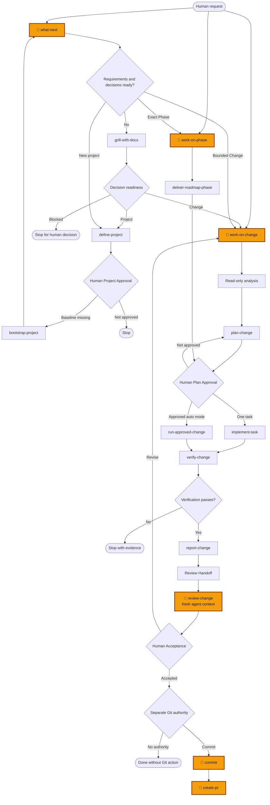

# Workflow Control Model

## English

### Overview

skill-forge treats AI coding as a controlled workflow rather than one autonomous prompt. Human-friendly entrypoints select small, independently governed skills, while approval, implementation, verification, adversarial review, and Git authority remain separate.

```text
Human entrypoints
├── what-next
├── work-on-change
├── work-on-phase
└── review-change
        ↓ route by repository evidence
Atomic workflows
├── grill-with-docs / define-project / bootstrap-project
├── plan-change / implement-task / run-approved-change
├── verify-change / report-change / review-change
└── deliver-roadmap-phase
```

The entrypoint layer simplifies operation. The atomic layer preserves narrow responsibilities, repeatable validation, and explicit authority boundaries.

### Human entrypoints

| Entrypoint | When to use it |
|---|---|
| `what-next` | You do not know the repository's current workflow state or safest next action |
| `work-on-change` | You want to move one bounded Change forward |
| `work-on-phase` | You want to move one exact Roadmap Phase forward |
| `review-change` | You opened a fresh agent to adversarially review completed work |
| `commit` | You explicitly authorize creation of a Git commit |
| `create-pr` | You explicitly authorize preparation or creation of a pull request |

Entrypoints inspect durable repository evidence instead of relying only on chat history: specifications, contracts, ADRs, Change artifacts, reports, Git state, and container commands.

### Controlled lifecycle



### Fresh review context

The implementing agent has already seen its own decisions, assumptions, and explanations. Reusing that context makes it easier to repeat the same blind spots. `review-change` is therefore a direct human entrypoint intended for a new agent session. The reviewer reads repository evidence, tries to disprove the completion claim, and does not modify the code under review.

### Subagents and context isolation

For medium or complex work, bounded exploration, testing, log analysis, implementation, and review tasks should be delegated when subagents are available. Noisy intermediate output stays in the subagent context and only verified conclusions return to the main thread.

The main agent still defines scope, prevents overlapping write ownership, checks returned evidence, integrates results, and runs final verification. Delegation improves context hygiene and parallelism; it does not bypass approval, sandbox, review, or authority boundaries.

### Installation is not authority

The interactive manager presents **Development Workflow** as one package. Installing it resolves the `what-next` dependency closure and installs all entrypoints and atomic workflows for the selected target.

```text
installed together ≠ authorized to execute together
```

Every workflow still enforces its own admission criteria and stop conditions. Human Project Approval, Human Plan Approval, independent review, Human Acceptance, commit, pull request, merge, release, and deployment remain distinct decisions.

---

## 繁體中文

### 概觀

skill-forge 不把 AI coding 視為一個可任意執行到底的 prompt，而是受控制的 workflow。人類使用少數容易記憶的入口，由入口選擇責任單一的 atomic skills；批准、實作、驗證、對抗式審查與 Git 權限仍彼此分離。

```text
人類入口
├── what-next
├── work-on-change
├── work-on-phase
└── review-change
        ↓ 根據 repository evidence 路由
Atomic workflows
├── grill-with-docs / define-project / bootstrap-project
├── plan-change / implement-task / run-approved-change
├── verify-change / report-change / review-change
└── deliver-roadmap-phase
```

入口層降低操作與記憶成本；atomic 層保留明確責任、可重複驗證與權限邊界。

### 人類常用入口

| 入口 | 使用時機 |
|---|---|
| `what-next` | 不確定 repository 目前在哪個流程狀態，或不知道最安全的下一步 |
| `work-on-change` | 要推進一個 bounded Change |
| `work-on-phase` | 要推進一個明確且唯一的 Roadmap Phase |
| `review-change` | 已另開乾淨 agent，要對完成內容進行對抗式審查 |
| `commit` | 明確授權建立 Git commit |
| `create-pr` | 明確授權準備或建立 pull request |

入口優先檢查持久化的 repository evidence，而不是只依賴聊天紀錄：規格、Contract、ADR、Change artifacts、reports、Git state 與 container commands。

### 受控開發流程

上方流程圖的核心順序是：

```text
決策與專案定義
→ Human Project Approval
→ Change 分析與計畫
→ Human Plan Approval
→ 受控實作
→ 驗證與報告
→ 新 Agent 對抗式 Review
→ Human Acceptance
→ 另行授權 Git 動作
```

任何一個前置階段完成，都不會自動授權下一個階段。

### 獨立 Review Context

實作者已經看過自己的決策、假設與解釋，沿用同一份 context 容易重複相同盲點。因此 `review-change` 是人類可以直接呼叫的入口，預期在新的 agent session 中執行。Reviewer 只依 repository 中可查驗的證據嘗試推翻完成聲明，不繼承 implementation authority，也不直接修改被審查的程式碼。

### Subagent 與 Context Isolation

中等或複雜任務若能拆出有界的探索、測試、log 分析、實作或審查工作，且環境支援 subagent，便應優先委派。大量中間輸出留在 subagent context，只有經整理與驗證的結論回到主 thread。

主 agent 仍負責定義範圍、避免重疊寫入、查核證據、整合結果及最終驗證。委派改善的是 context hygiene 與平行效率，不會繞過人工批准、sandbox、獨立審查或其他權限邊界。

### 安裝不等於授權

互動式 manager 將 **Development Workflow** 顯示成一個套件。安裝時會解析 `what-next` 的 dependency closure，並替選定 target 安裝所有入口與 atomic workflows。

```text
一起安裝 ≠ 獲准一起執行
```

每個 workflow 仍遵守自己的 admission criteria 與 stop conditions。Human Project Approval、Human Plan Approval、獨立 review、Human Acceptance、commit、pull request、merge、release 與 deployment 都是彼此獨立的決策。
