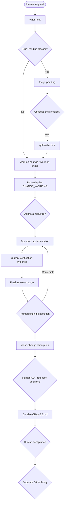

# Workflow Control Model

## English

### Evidence layers

The Development Workflow separates durable project truth from temporary delivery evidence:

```text
Durable truth: SPEC / CONTRACTS / accepted ADRs / ROADMAP / runbooks
Pending inbox: docs/PENDING.md
Active Change: changes/<id>/CHANGE_WORKING.md
Independent findings: changes/<id>/REVIEW.md
Closed Change: changes/<id>/CHANGE.md
```

Working records are intentionally temporary. `close-change` may propose their deletion only after an Absorption Matrix maps every consequential item to durable truth, Pending, an explicit retention decision, the final Change record, or an intentional discard reason.

### Human entrypoints

| Entrypoint | Use |
|---|---|
| `what-next` | Route from lifecycle, Pending, decision, review and closure evidence |
| `work-on-change` | Move one bounded Change with ceremony proportional to risk |
| `work-on-phase` | Move one exact Roadmap Phase through closed child Changes |
| `review-change` | Fresh adversarial review: one full pass plus one targeted confirmation by default |
| `triage-pending` | Validate and classify deferred discoveries without deciding or implementing them |
| `close-change` | Absorb temporary evidence and stop at the Human ADR Retention Gate |
| `commit` / `create-pr` | Separately authorized Git work |

### Controlled lifecycle



### Risk determines ceremony

- trivial: bounded edit, targeted evidence and concise handoff when policy permits;
- low: lightweight working record, verification and closure; review when risk/policy warrants;
- medium: approved plan, current verification, one full review, targeted confirmation, closure;
- high/extreme: full traceability, checkpoints, explicit approvals, independent review and acceptance.

### Pending is an inbox, not a queue

Workflow skills may capture a valid out-of-scope discovery in `docs/PENDING.md` without expanding the active Change. `triage-pending` validates evidence, checks the blocking trigger, merges duplicates and routes the item to specification, contract, ADR candidate, Roadmap, future Change, runbook, final Change record or dismissal. Unrelated items never block current work merely because they exist.

### ADR retention is human authority

Agents may identify a durable-decision gap. They must present a Decision Retention Packet and ask whether the choice is worth an ADR. Only after a human selects `Create ADR` may an agent draft `Proposed`; a separate explicit confirmation is required for `Accepted`, modification of an Accepted ADR or `Superseded`. Deleting a working artifact never grants ADR authority.

### Fresh review and fresh closure

The reviewer tries to disprove behavior and evidence before inspecting document cosmetics. Findings live under stable IDs in one `REVIEW.md`; documentation-only remediation does not restart a full review. A fresh closer then reads bounded final inputs and compresses them—it does not rediscover or re-review the project. The prior reviewer may perform a narrow closure-integrity check without opening another code-review round.

Installation never grants execution authority. Decision, approval, review, retention, acceptance, Git, release and deployment gates remain separate.

---

## 繁體中文

Development Workflow 將資料分成：長期有效的 SPEC／CONTRACTS／Accepted ADR／ROADMAP、受控的 `docs/PENDING.md` inbox、暫時的 `CHANGE_WORKING.md`、單一 `REVIEW.md`，以及結案後唯一的 `CHANGE.md`。

流程核心是：

```text
Pending／決策檢查
→ 依風險規劃與批准
→ 有界實作
→ 當前驗證證據
→ 新 context 一次完整 review
→ 人類 disposition
→ 一次 targeted confirmation
→ close-change absorption
→ Human ADR Retention Gate
→ durable CHANGE.md
→ Human Acceptance
→ 另行授權 Git 動作
```

Pending 只保存當時有效但不屬於目前 scope 的發現，不是 FIFO backlog。只有 blocking trigger 已到或直接否定下一步時才阻擋工作。

Working artifacts 在 absorption matrix 完成後可以刪除；重要取捨不能因刪檔就由 agent 自動升格為 ADR。Agent 只能提出 candidate，人類先決定是否值得建立，再另外確認是否接受。

Reviewer 優先審查行為、安全、資料、Contract、測試鑑別力與完成宣稱；表頭、輪次、行數等 temporary metadata 原則上不構成產品 finding。預設最多一次完整 review 加一次針對 accepted findings 的確認。
